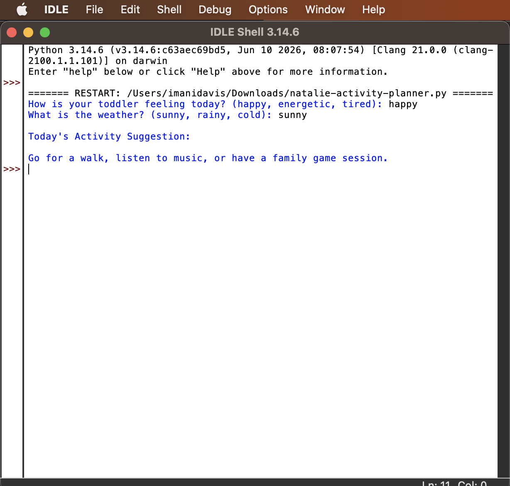

# Natalie D Activity Planner

## Demo

A beginner Python project that suggests activities for toddlers based on their mood and the weather.

## Why I Built This

As a father of a 2-year-old daughter named Natalie, I wanted to create a simple program that helps generate activity ideas based on how she's feeling and the weather outside.

## Features

- Mood-based activity suggestions
- Weather-based recommendations
- Beginner-friendly Python code

## Skills Used

- Python
- User Input
- Conditional Logic
- Problem Solving
